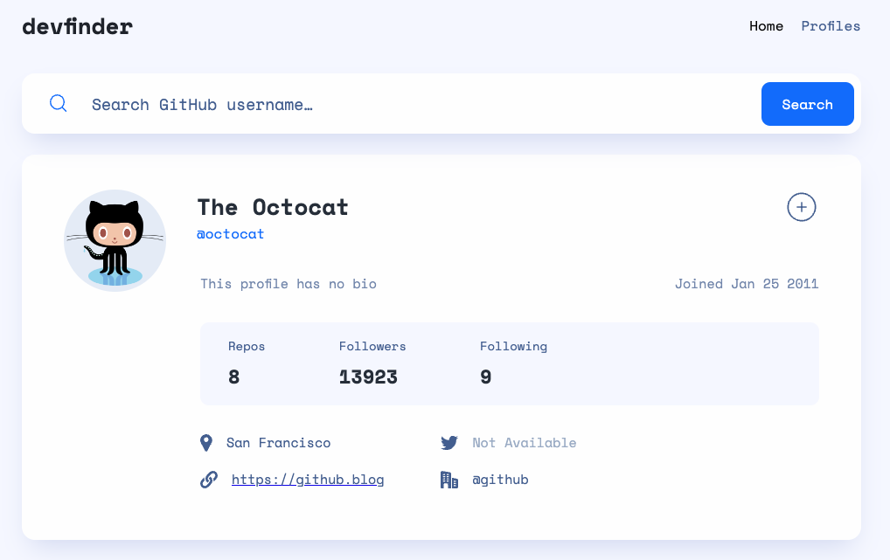

# About this project

This project is aboud building a multiple-page app that allows users to search for and save Github user profiles. 



The logic of this app is very similar as the dictionary app that you have worked on:

* The app has two pages, the home page and the saved profiles page.
* In the home page, the app allows users to search for a GitHub user profile by entering a username.
* In the home page, the app displays the user's profile information, such as the user's name, username, bio, and the number of followers and following if the user exists.
* In the home page, the app allows users to save a profile that has been searched for by clicking the save button. Once the save button is clicked, the app will save the profile information, and display a check mark in the place of the save button.
* In the saved profiles page, the app displays a list of saved profiles, with each profile showing the user's avatar, username, and two buttons - viewing button and delete button. The viewing button, once clicked, will take the user to the home page and display the profile information of the saved profile. The delete button, once clicked, will delete the target saved profile from the list.

You can find a set of screensnaps in the `/frontend/design` folder corresponding to the above logic. The names of the screensnaps aim to be descriptive, and help you map the above logic to each screensnap.

You will need to make API calls to GitHub to get the user's profile information. You can find the API documentation [here](https://docs.github.com/en/rest/users/users?apiVersion=2022-11-28#get-a-user).

When you read it, you might find the authentication part confusing. You don't need authentication to retrieve a user's profile. All it takes is to send a GET request to the API endpoint with the username as a parameter. For example, if you want to get the profile information of the user `octocat`, you can send a GET request to `https://api.github.com/users/octocat`. The following lines of code show how you can do it with Axios (inside an async function and in a React component):

```
let username = 'octocat';
const response = await axios.get(
    `https://api.github.com/users/${username}`
);
```

In short, the API endpoint is `https://api.github.com/users/` followed by the username.

## Frontend and backend

The codebase of the frontend is in the `/frontend` folder, and the codebase of the backend is in the `/backend` folder. The frontend is merely a blank Create React App codebase, and the backend is a sample Express + MongoDB codebase. You will need to build the frontend and backend from scratch.

## Static resources

All static resources can be found in the `/frontend/images` folder. In addition to the images, you will also find [React Incons](https://react-icons.github.io/react-icons/) to be helpful in this project.

## Design

You can find the design specification of this project in the `/frontend/design` folder.

## Start the project

Before starting the project, you need to install the dependencies by running `npm install`. To start the project, you can run `npm start`.